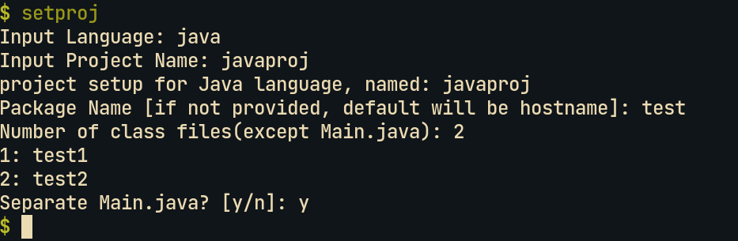
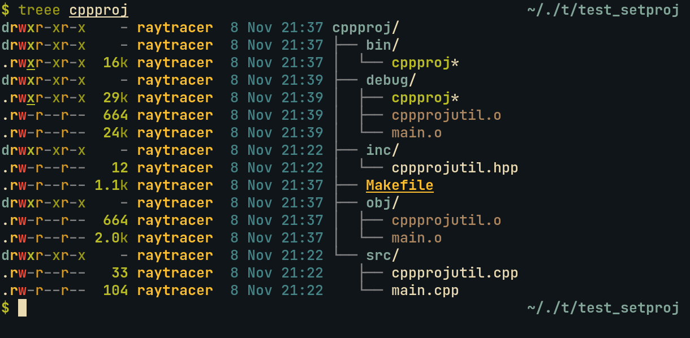
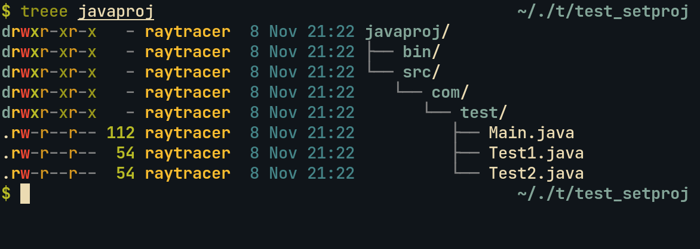
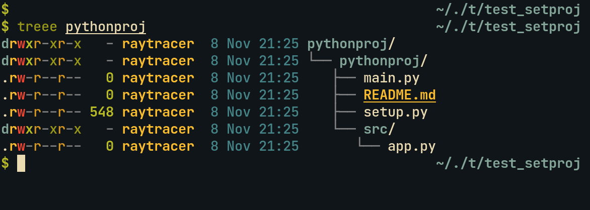

# MKPROJ

Have project setup **instantly** on _cli_.

As programmer and terminal(and terminal tools) lover, I wanted something which will ease the redundant task of setting up project for the languages I use. The following project helps in achieving just that.

Let's see how it is done. Here's a project creation demo for `java` language:



<br>

### Supported Languages:

Currenlty, following languages(and tool/s) are supported in this project for _project creation_:

* C
* C++
* Java
* Python
* Web Designing(html,css,js)
* Java-Servlet

<br>


### What it does:

It's an interactive project which puts all the necessary files/folders in place as user tells and fills up some things already which is to be filled everytime,

Here's an example of fillup for `Java-Servlet`:


And here's the directory hierarchy for all the supported languages:

* **C**:


* **C++**:




* **Java**:



* **Python**:



* **Web Designing**:


* **Java Servlet**:


```
Note: This project is still in development stage
```
